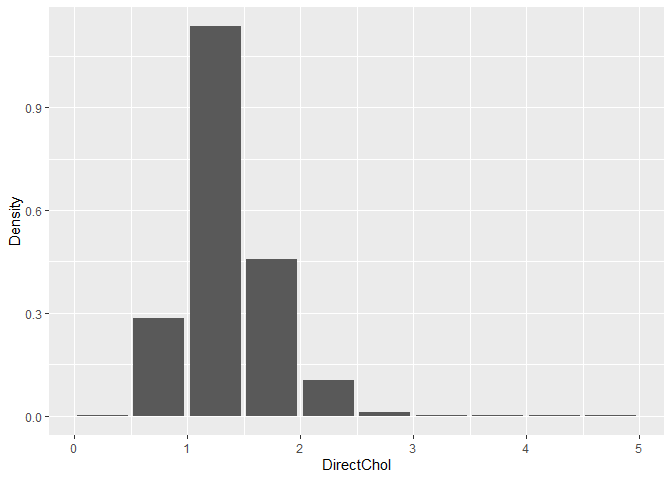
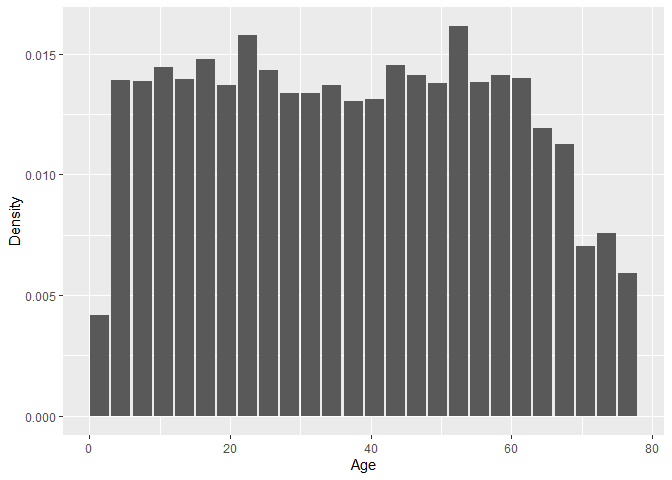
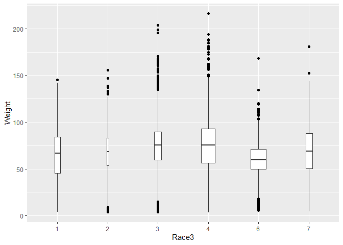
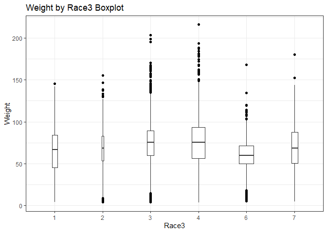
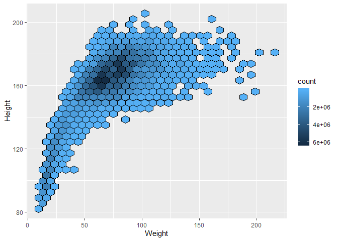

<!-- README.md is generated from README.Rmd. Please edit that file -->

## svydb - Survey statistics in a database

  - [Introduction](#intro)
  - [Installation](#installation)
  - [Examples](#examples)
      - [Survey Statistics](#survey-statistics)
          - [Survey Total](#survey-total)
          - [Survey Mean](#survey-mean)
          - [Regression](#regression)
      - [Graphics](#graphics)
          - [Histogram](#histogram)
          - [Boxplot](#boxplot)
          - [Hexagon Binning](#hexagon-binning)
  - [SQL usage](#sql-usage)
  - [Timings](#timings)
      - [Survey Total Timing](#survey-total-timing)
      - [Survey Mean Timing](#survey-meanal-timing)
      - [Regression Timing](#regression-timing)
      - [Histogram Timing](#histogram-timing)
      - [Boxplot Timing](#boxplot-timing)
      - [Hexagon Binning Timing](#hexagon-binning-timing)
  - [Abstract](#abstract)

## Introduction

Most current software for survey analysis reads the data into memory,
however, most of these computations can actually be expressed as
database operations. The aim of this package is to provide a set of
functions which allows survey statistics to be computed directly inside
a database. To do this, `dplyr` and `dbplpy` are used. Lastly, this
package takes a step further, it also provides graphics computation
directly inside a database, where data tables are read into memory only
when necessary.

As noted by Professor Lumley
[here](https://notstatschat.rbind.io/2018/06/09/survey-analysis-in-sql/).
*This “approach does seem to be useful for large survey data sets – and
for smaller data sets the dplyr version is faster than the survey
package, though more limited.”*

## Installation

This packages can be installed by using the `devtools` package.

``` r
devtools::install_github("chrk623/svydb")
```

Currently, there are some warning messages regarding depreciated
functions in `rlang`, at the moment this should not effect `svydb`,
updates will be made soon.

This package is still under development, if there are any **BUGS**
please report to [Issues](https://github.com/chrk623/svydb/issues).

## Examples

### Survey Statistics

#### Survey Total

Note that databases does not understand what a `factor` is. Therefore,
if a variable is `factor`, this information needs to be provided to the
function via the `num` argument.

``` r
library(svydb)
data(nhane)
nh.dbsurv = svydbdesign(st = SDMVSTRA, wt = WTMEC2YR, id = SDMVPSU, data = nhane)
svydbtotal(x = DirectChol, design = nh.dbsurv, num = T)
#>                Total       SE
#> DirectChol 355960579 21830151
```

#### Survey Mean

``` r
my_mean = svydbmean(x = Race3, design = nh.dbsurv, num = F)
my_mean
#>             Mean     SE
#> Race3_1 0.097238 0.0208
#> Race3_2 0.069853 0.0154
#> Race3_3 0.628595 0.0407
#> Race3_4 0.124373 0.0239
#> Race3_6 0.050620 0.0080
#> Race3_7 0.029322 0.0045
coef(my_mean)
#> [1] 0.09723817 0.06985263 0.62859467 0.12437279 0.05061970 0.02932205
SE(my_mean)
#>     Race3_1     Race3_2     Race3_3     Race3_4     Race3_6     Race3_7 
#> 0.020820360 0.015357512 0.040693583 0.023923479 0.007978204 0.004472943
```

#### Regression

In `svydblm` we denote factors by wrapping the variable with
`factor()`.

``` r
fit.dbsurv = svydblm(DirectChol ~ Age + BMI + factor(Gender), design = nh.dbsurv)
#> Joining, by = c("intercept_xtx", "Age_xtx", "BMI_xtx", "Gender_2_xtx")
#> Joining, by = c("intercept_xtx", "Age_xtx", "BMI_xtx", "Gender_2_xtx")
#> Joining, by = c("intercept_xtx", "Age_xtx", "BMI_xtx", "Gender_2_xtx")
summary(fit.dbsurv)
#> 
#> Call:
#> svydblm(formula = DirectChol ~ Age + BMI + factor(Gender), design = nh.dbsurv)
#> 
#> Survey design:
#> svydbdesign(st = SDMVSTRA, id = SDMVPSU, wt = WTMEC2YR, data = nhane)
#> 
#> Coefficients:
#>             Estimate Std. Error t value Pr(>|t|)    
#> intercept  1.6321111  0.0248245   65.75  < 2e-16 ***
#> Age        0.0032541  0.0003245   10.03 9.02e-08 ***
#> BMI       -0.0186356  0.0010519  -17.71 5.53e-11 ***
#> Gender_2   0.2180855  0.0119792   18.20 3.83e-11 ***
#> ---
#> Signif. codes:  0 '***' 0.001 '**' 0.01 '*' 0.05 '.' 0.1 ' ' 1
coef(fit.dbsurv)
#>      intercept         Age         BMI  Gender_2
#> [1,]  1.632111 0.003254104 -0.01863557 0.2180855
SE(fit.dbsurv)
#>    intercept          Age          BMI     Gender_2 
#> 0.0248245459 0.0003244995 0.0010519481 0.0119791933
vcov(fit.dbsurv)
#>               intercept           Age           BMI      Gender_2
#> intercept  6.162581e-04  2.295490e-06 -2.251523e-05  1.758284e-04
#> Age        2.295490e-06  1.052999e-07 -2.020572e-07  1.017712e-06
#> BMI       -2.251523e-05 -2.020572e-07  1.106595e-06 -8.370514e-06
#> Gender_2   1.758284e-04  1.017712e-06 -8.370514e-06  1.435011e-04
```

Replicated weights along with some other survey statistics are also
supported in `svydb`, please read the help page for more information.

### Graphics

All graphics produced by `svydb` uses `ggplot2`, this means that users
can customise their plot with existing `ggplot2` functions. For example,
add a title with `ggtitle()`.

#### Histogram

``` r
svydbhist(x = DirectChol, design = nh.dbsurv)
```



``` r
svydbhist(x = Age, design = nh.dbsurv, binwidth = 3)
```



#### Boxplot

``` r
p = svydbboxplot(x = Weight, groups = Race3, design = nh.dbsurv,
     outlier = T, all.outlier = T, varwidth = T)
```



``` r
p + ggtitle("Weight by Race3 Boxplot") + theme_bw()
```



#### Hexagon Binning

``` r
hb = svydbhexbin(Height ~ Weight, design = nh.dbsurv)
svydbhexplot(hb)
```



## SQL Usage

To use `svydb` functions with a **SQL** connection, it is as simple as
creating a `svydbdesign` with a **SQL** table in **R**. Currently, only
`MonetDB` has been tested. In theory, it should work with other
databases as long as it provides enough supported functions that `svydb`
requires. Or, at the very least these database should work with `svydb`
with some minor *tweaking*.

To do this,

``` r
# devtools::install_github("hannesmuehleisen/MonetDBLite-R")
# install.packages(c("DBI", "dbplyr"))
library(MonetDBLite)
library(DBI)
library(dbplyr)
#> 
#> Attaching package: 'dbplyr'
#> The following objects are masked from 'package:dplyr':
#> 
#>     ident, sql
con = dbConnect(MonetDBLite())
dbWriteTable(con, "nhane", nhane)
#> Identifier(s) "X", "SurveyYr", "ID", "Gender", "Age", "AgeMonths", "Race1", "Race3", "Education", "MaritalStatus", "HHIncome", "HHIncomeMid", "Poverty", "HomeRooms", "HomeOwn", "Work", "Weight", "Length", "HeadCirc", "Height", "BMI", "BMICatUnder20yrs", "BMI_WHO", "Pulse", "BPSysAve", "BPDiaAve", "BPSys1", "BPDia1", "BPSys2", "BPDia2", "BPSys3", "BPDia3", "Testosterone", "DirectChol", "TotChol", "UrineVol1", "UrineFlow1", "UrineVol2", "UrineFlow2", "Diabetes", "DiabetesAge", "HealthGen", "DaysPhysHlthBad", "DaysMentHlthBad", "LittleInterest", "Depressed", "nPregnancies", "nBabies", "Age1stBaby", "SleepHrsNight", "SleepTrouble", "PhysActive", "PhyActiveDays", "TVHrsDay", "ComputerHrsDay", "Alcohol12PlusYr", "AlcoholDay", "AlcoholYear", "SmokeNow", "Smoke100", "SmokeAge", "Marijuana", "AgeFirstMarij", "RegularMarij", "AgeRegMarij", "HardDrugs", "SexEver", "SexAge", "SexNumPartnLife", "SexNumPartYear", "SameSex", "SexOrientation", "WTINT2YR", "WTMEC2YR", "SDMVPSU", "SDMVSTRA" contain uppercase or reserved SQL characters and need(s) to be quoted in queries.
#> Identifier(s) "Work" are reserved SQL keywords and need(s) to be quoted in queries.
nhane.db = tbl(con, "nhane")
```

Then for
example,

``` r
nh2.dbsurv = svydbdesign(st = SDMVSTRA, wt = WTMEC2YR, id = SDMVPSU, data = nhane.db)
svydbtotal(x = DirectChol, design = nh2.dbsurv, num = T)
#>                Total       SE
#> DirectChol 355960579 21830151
```

Please note that, `MonetDBLite` is no longer available on CRAN.
Therefore, if one wishes to continue using `MonetDB`, you must install
it via Github. More information can be found
[here](https://github.com/MonetDB/MonetDBLite-R/issues/38).

## Timings

The following timings compares the speed of the `survey` package and
`svydb`. The <span style="color:red">red</span> line represents the
`survey` pacakge, <span style="color:green">green</span> line represents
`svydb` with a local data frame, and the
<span style="color:blue">blue</span> line represents `svydb` with a
database connection.
<!-- Specs of the PC used to compute the following times: -->

<!-- - CPU: AMD Ryzen 5 3600X 6-Core Processor, 3800 Mhz -->

<!-- - GPU: GeForce GTX 1660 TI GAMING X 6G -->

<!-- - RAM: 16 GB DDR4 @ 3200Mhz -->

<!-- - Storage: 250GB M.2 NVMe, R/W 3,500MB/s/2,300MB/s -->

### Survey Total Timing


### Survey Mean Timing


### Regression Timing


### Histogram Timing


### Boxplot Timing


### Hexagon Binning Timing


## Abstract

Multistage surveys can give rise to moderately large data sets (tens of
millions of rows). Most current software for survey analysis reads the
data into memory, the survey package in R provides fairly comprehensive
analysis features for complex surveys which are small enough to fit into
memory easily, however, most of the computations can actually be
expressed as database operations. There is already a similar approach
with the sqlsurvey package in R which performs substantial computation
in SQL in the database, importing only small summary tables into R, this
approach scales to very large surveys such as the American Community
Survey and the Nationwide Emergency Department Sample, but this approach
causes compatible issues with different types of databases. Therefore,
in this project I will work on implementing R functions and testing some
survey computations using the dplyr and dbplyr R package as a database
interface.

Supervisor: Professor Thomas Lumley

Thomas wrote something about this package
[here](https://notstatschat.rbind.io/2018/06/09/survey-analysis-in-sql/).
